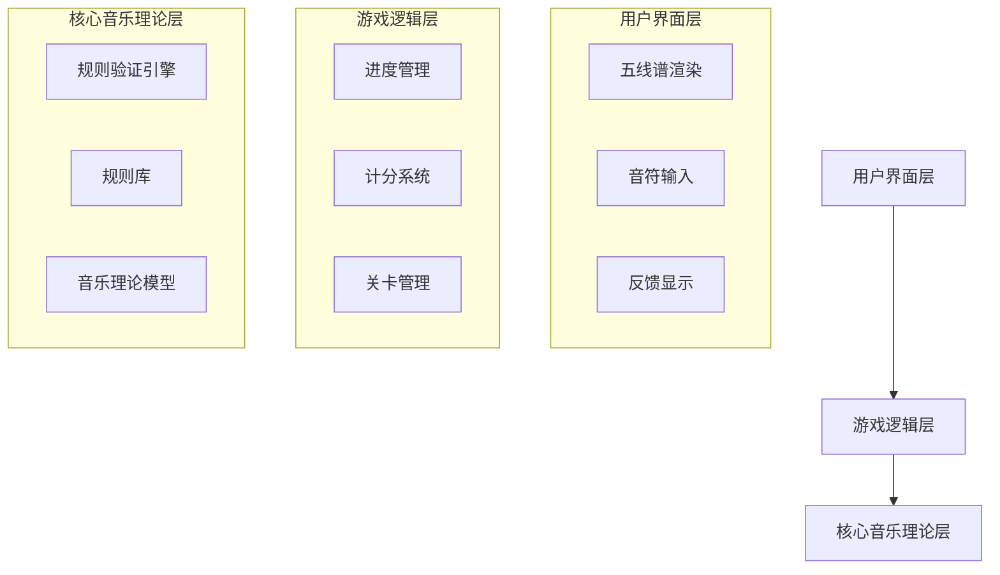

# 设计文档

## 概述

和声游戏是一个基于 Web 的互动式音乐理论学习应用，帮助学生掌握《斯波索宾和声学教程》中的和弦连接规则。系统采用模块化架构，将音乐记谱渲染、规则验证引擎和游戏逻辑清晰分离，确保可维护性和可扩展性。

## 架构

### 整体架构

系统采用三层架构：



### 技术栈

- **前端框架**: React + TypeScript
- **音乐记谱**: VexFlow 4.x（TypeScript 音乐记谱库）
- **状态管理**: React Context API
- **数据持久化**: LocalStorage
- **构建工具**: Vite
- **测试框架**: Vitest + fast-check（属性测试）

## 组件和接口

### 1. 音乐理论核心模块

#### Note（音符）
```typescript
interface Note {
  pitch: string;        // 音高，如 "C4", "D#5"
  octave: number;       // 八度
  duration: string;     // 时值，如 "q"（四分音符）
}
```

#### Chord（和弦）
```typescript
interface Chord {
  notes: Note[];        // 四个声部的音符 [soprano, alto, tenor, bass]
  romanNumeral: string; // 罗马数字标记，如 "I", "V7"
  inversion: number;    // 转位：0=原位，1=第一转位，等
}
```

#### ChordProgression（和弦进行）
```typescript
interface ChordProgression {
  chords: Chord[];
  key: string;          // 调性，如 "C major", "A minor"
}
```

### 2. 规则验证引擎

#### ValidationRule（验证规则）
```typescript
interface ValidationRule {
  id: string;
  name: string;
  chapter: number;              // 对应教材章节
  priority: number;             // 规则优先级（用于确定应用顺序）
  description: string;
  validate: (progression: ChordProgression, 
             chordIndex: number) => ValidationResult;
}
```

**设计决策**: 添加 `priority` 字段以支持需求 9.2（按正确顺序应用规则）。规则按以下优先级顺序验证：
1. **结构规则** (priority 100-199): 声部范围、声部交叉等基础结构问题
2. **进行规则** (priority 200-299): 平行五八度、反向进行等声部运动规则
3. **和弦规则** (priority 300-399): 重复音、省略音等和弦内部规则
4. **风格规则** (priority 400-499): 特定风格或高级规则

这种分层确保基础错误优先显示，帮助学生循序渐进地理解问题。

#### ValidationResult（验证结果）
```typescript
interface ValidationResult {
  isValid: boolean;
  errors: ValidationError[];
}

interface ValidationError {
  ruleId: string;
  ruleName: string;
  message: string;
  chapterReference: string;     // 教材章节引用
  affectedVoices: number[];     // 受影响的声部索引
  affectedChords: number[];     // 受影响的和弦索引
}
```

#### RuleEngine（规则引擎）
```typescript
class RuleEngine {
  private rules: Map<number, ValidationRule[]>;  // 按章节组织规则
  
  // 加载指定章节的所有规则
  loadRulesForChapter(chapter: number): void;
  
  // 验证和弦进行
  // 规则按优先级顺序应用：首先检查基础结构规则（声部范围、声部交叉），
  // 然后检查声部进行规则（平行五八度），最后检查和弦结构规则（重复音等）
  validate(progression: ChordProgression, 
           chapter: number): ValidationResult;
  
  // 添加新规则
  registerRule(rule: ValidationRule): void;
}
```

### 3. 练习题管理

#### Exercise（练习题）
```typescript
interface Exercise {
  id: string;
  chapter: number;
  number: number;               // 练习题编号（每章两题）
  instructions: string;         // 题目说明
  startingChords: Chord[];      // 给定的起始和弦
  expectedLength: number;       // 期望的和弦数量（支持不同数量）
  constraints?: ExerciseConstraints;
  solution: ChordProgression;   // 参考答案
}

interface ExerciseConstraints {
  requiredChords?: string[];    // 必须使用的和弦
  forbiddenChords?: string[];   // 禁止使用的和弦
  specificRules?: string[];     // 特定规则ID（允许练习题指定验证哪些规则）
}
```

#### ExerciseRepository（练习题仓库）
```typescript
class ExerciseRepository {
  // 获取指定章节的练习题
  getExercisesForChapter(chapter: number): Exercise[];
  
  // 获取单个练习题
  getExercise(chapter: number, exerciseNumber: number): Exercise;
  
  // 加载所有练习题数据
  loadExercises(): Promise<void>;
}
```

### 4. 游戏逻辑层

#### GameState（游戏状态）
```typescript
interface GameState {
  currentLevel: number;         // 当前关卡（1-60）
  currentExercise: number;      // 当前练习题（1或2）
  score: number;                // 总分
  unlockedLevels: number[];     // 已解锁关卡
  completedExercises: Set<string>; // 已完成练习题ID
  currentProgression: ChordProgression;
}
```

#### GameManager（游戏管理器）
```typescript
class GameManager {
  private state: GameState;
  private ruleEngine: RuleEngine;
  private exerciseRepo: ExerciseRepository;
  
  // 开始新关卡
  startLevel(level: number): void;
  
  // 提交和弦进行进行验证
  submitProgression(progression: ChordProgression): ValidationResult;
  
  // 完成当前练习题
  completeExercise(): void;
  
  // 保存游戏进度
  saveProgress(): void;
  
  // 加载游戏进度
  loadProgress(): void;
}
```

### 5. 用户界面组件

#### StaffNotation（五线谱组件）
```typescript
interface StaffNotationProps {
  progression: ChordProgression;
  onNoteClick?: (chordIndex: number, voiceIndex: number) => void;
  highlightedNotes?: Array<{chordIndex: number, voiceIndex: number}>;
}
```

#### NoteInput（音符输入组件）
```typescript
interface NoteInputProps {
  voice: number;                // 当前声部
  onNoteSelect: (note: Note) => void;
  availableNotes: Note[];       // 可选音符列表
}
```

#### ErrorDisplay（错误显示组件）
```typescript
interface ErrorDisplayProps {
  errors: ValidationError[];
  onErrorClick?: (error: ValidationError) => void;
}
```

#### FeedbackDisplay（反馈显示组件）
```typescript
interface FeedbackDisplayProps {
  isCorrect: boolean;           // 和弦进行是否正确
  message?: string;             // 反馈消息
  onDismiss?: () => void;
}
```

**设计决策**: 分离错误显示和成功反馈组件，使界面更清晰。ErrorDisplay 专注于详细的错误信息和教学反馈，而 FeedbackDisplay 提供即时的正确/错误视觉反馈（如绿色勾号或红色叉号）。

#### LevelSelector（关卡选择组件）
```typescript
interface LevelSelectorProps {
  levels: LevelInfo[];
  currentLevel: number;
  onLevelSelect: (level: number) => void;
}

interface LevelInfo {
  number: number;
  title: string;
  isUnlocked: boolean;
  isCompleted: boolean;
}
```

## 数据模型

### 本地存储数据结构

```typescript
interface SavedGameData {
  version: string;              // 数据版本
  lastPlayed: string;           // 最后游玩时间（ISO 8601）
  state: {
    score: number;
    currentLevel: number;
    unlockedLevels: number[];
    completedExercises: string[];
  };
}
```

### 练习题数据文件格式（JSON）

```json
{
  "chapter": 1,
  "title": "三和弦的原位",
  "exercises": [
    {
      "id": "1-1",
      "number": 1,
      "instructions": "完成以下和弦进行：I - IV - V - I",
      "key": "C major",
      "startingChords": [
        {
          "notes": [
            {"pitch": "G4", "octave": 4, "duration": "w"},
            {"pitch": "E4", "octave": 4, "duration": "w"},
            {"pitch": "C4", "octave": 4, "duration": "w"},
            {"pitch": "C3", "octave": 3, "duration": "w"}
          ],
          "romanNumeral": "I",
          "inversion": 0
        }
      ],
      "expectedLength": 4,
      "solution": {
        "chords": [...]
      }
    }
  ]
}
```

## 正确性属性

*属性是关于系统应该满足的特征或行为的形式化陈述——本质上是关于系统应该做什么的正式声明。属性是人类可读规范和机器可验证正确性保证之间的桥梁。*

### 属性 1: 规则验证完整性
*对于任意*和弦进行和章节号，如果进行违反了该章节的任何规则，那么验证引擎必须识别出所有违规情况，并为每个错误提供规则名称和章节引用
**验证需求: 3.1, 3.3, 4.1, 4.3, 9.5**

### 属性 2: 分数单调递增
*对于任意*游戏状态，当且仅当玩家正确完成一个练习题时，新分数必须等于旧分数加1
**验证需求: 3.2, 6.2**

### 属性 3: 错误不扣分
*对于任意*游戏状态和包含错误的和弦进行提交，分数必须保持不变
**验证需求: 3.3, 6.3**

### 属性 4: 关卡解锁顺序性
*对于任意*关卡 N（1 ≤ N < 60），关卡 N+1 只有在关卡 N 的两个练习题都完成后才能解锁
**验证需求: 1.3**

### 属性 5: 进度持久化往返一致性
*对于任意*游戏状态（包括分数、当前关卡、已解锁关卡和已完成练习题），保存到本地存储后再加载应该得到等价的游戏状态
**验证需求: 6.5, 7.1, 7.2, 7.3, 7.4**

### 属性 6: 规则累积性
*对于任意*章节 N（2 ≤ N ≤ 60），该章节的规则集必须包含所有前面章节（1 到 N-1）的规则，加上该章节新引入的规则
**验证需求: 3.5, 9.3, 9.4**

### 属性 7: 平行五度检测正确性
*对于任意*两个连续和弦，如果任意两个声部之间在第一个和弦中形成完全五度，且这两个声部以平行运动到第二个和弦中仍形成完全五度，则验证引擎必须检测到平行五度错误
**验证需求: 3.4**

### 属性 8: 平行八度检测正确性
*对于任意*两个连续和弦，如果任意两个声部之间在第一个和弦中形成八度，且这两个声部以平行运动到第二个和弦中仍形成八度，则验证引擎必须检测到平行八度错误
**验证需求: 3.4**

### 属性 9: 错误信息完整性
*对于任意*验证错误，错误对象必须包含：规则ID、规则名称、错误消息、章节引用、受影响的声部索引和受影响的和弦索引
**验证需求: 4.1, 4.2, 4.3**

### 属性 10: 多错误同时显示
*对于任意*包含多个规则违反的和弦进行，验证结果必须包含所有错误，不能遗漏任何一个
**验证需求: 4.4**

### 属性 11: 练习题数据完整性
*对于任意*章节（1 ≤ chapter ≤ 60），必须恰好存在两个练习题，且每个练习题必须包含章节编号、说明、起始和弦和参考答案
**验证需求: 1.2, 5.1, 5.2, 10.2**

### 属性 12: 音符输入验证
*对于任意*音符输入和当前和弦状态，如果该音符与其他已输入声部不能构成有效和弦（根据当前章节的规则），则系统必须拒绝该输入
**验证需求: 2.4**

### 属性 13: 音符编辑幂等性
*对于任意*和弦进行，删除一个音符后再添加相同的音符，应该得到与原始状态等价的和弦进行
**验证需求: 2.5**

### 属性 14: 练习题约束执行
*对于任意*带有约束条件的练习题和玩家输入，如果输入违反了练习题的约束（如禁止使用的和弦或未使用必需的和弦），则系统必须拒绝该输入
**验证需求: 5.4**

### 属性 15: 五线谱渲染包含性
*对于任意*和弦进行，渲染后的五线谱表示必须包含所有输入的音符，且音符的音高和时值必须正确显示
**验证需求: 2.2**

### 属性 16: 规则应用顺序一致性
*对于任意*和弦进行和章节号，验证引擎必须按照规则优先级顺序应用规则（结构规则 → 进行规则 → 和弦规则 → 风格规则），确保基础错误优先报告
**验证需求: 9.2**

## 错误处理

### 验证错误
- 平行五度/八度：高亮涉及的两个声部和两个和弦
- 声部超出音域：高亮超出音域的音符
- 声部交叉：高亮交叉的两个声部
- 重复音错误：高亮不正确的重复音

### 数据加载错误
- 练习题数据缺失：显示友好错误消息，提供默认练习题
- 本地存储损坏：重置为初始状态，通知用户

### 用户输入错误
- 无效音符：提供视觉反馈，不允许输入
- 不完整和弦：禁用提交按钮直到和弦完整

### 视觉反馈机制
**设计决策**: 为了满足需求 8.3（为正确和错误的和弦进行提供视觉反馈），系统采用多层次反馈策略：

1. **即时反馈**: 
   - 正确提交：显示绿色成功提示，播放愉悦的音效
   - 错误提交：显示红色错误提示，高亮问题区域

2. **详细反馈**:
   - 错误时：ErrorDisplay 组件显示所有违规规则的详细说明
   - 正确时：FeedbackDisplay 显示鼓励消息和获得的分数

3. **持续反馈**:
   - 五线谱上用不同颜色标记：正确音符（黑色）、错误音符（红色）、待输入（灰色）
   - 分数实时更新显示在界面顶部

## 测试策略

### 单元测试
- 音符和和弦数据模型的创建和操作
- 各个验证规则的独立测试（使用已知的正确和错误示例）
- 游戏状态转换的特定场景
- UI 组件的渲染和交互

### 属性测试
使用 fast-check 库进行属性测试，每个测试至少运行 100 次迭代：

- **属性 1-16**: 为每个正确性属性编写对应的属性测试
- 生成随机和弦进行并验证规则引擎的一致性
- 生成随机游戏操作序列并验证状态不变量
- 测试保存/加载的往返一致性
- 测试规则应用顺序的正确性

每个属性测试必须使用以下标签格式：
```typescript
// Feature: harmony-game, Property 1: 规则验证完整性
test.prop([fc.array(chordArbitrary), fc.integer({min: 1, max: 60})])(
  '规则验证必须识别所有违规', 
  (progression, chapter) => {
    // 测试实现
  }
);
```

### 集成测试
- 完整的练习题流程：从开始到提交验证
- 关卡解锁和进度保存
- VexFlow 渲染集成

### 端到端测试
- 完整游戏流程：从第一关到完成多个关卡
- 跨会话的进度持久化
